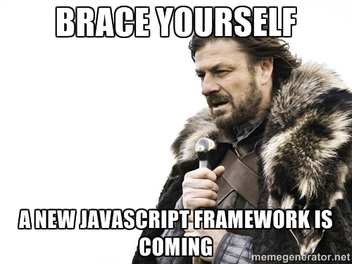

<p align="center">
    
    <h1 align="center">TREASURE JS</h1>
    <h4 align="center"><cite>A <u>JavaScript WikiPedia</u> for GitHub</cite></h4>
    <h4 align="center">
        <a href="https://github.com/TechOUs/treasurejs.github.io">WEBSITE</a> &nbsp;&nbsp; | &nbsp;&nbsp;
        <a href="">CLI</a> &nbsp;&nbsp; | &nbsp;&nbsp;
        <a href="release_notes.md">HISTORY</a> &nbsp;&nbsp; | &nbsp;&nbsp;
        <a href="CONTRIBUTING.md">CONTRIBUTE</a> &nbsp;&nbsp; | &nbsp;&nbsp;
        <a href="https://github.com/TechOUs/Treasurejs-logo">LOGO</a>
    </h4>
    <h4 align="center">
        &nbsp;&nbsp;
        &nbsp;&nbsp;
        &nbsp;&nbsp;
        &nbsp;&nbsp;
        &nbsp;&nbsp;
        
    </h4>
</p>

A **Wikipedia for JavaScript** where to can get JavaScript:

* **Free Courses links which are absolutely free for everyone.**
* **Frameworks list**
* **Libraries list**
* **Tools list**
* **Extensions**
* **Other Popular GitHub repos info**

We need some support so please do *star, watch* and [**contribute**](CONTRIBUTING.md) to our repo

Keep Supporting!

<p align="center">
    
</p>

# Contents Table

* [Release Types](#release-types)
  * [How to stay updated with new names in JS](#How-to-Stay-Updated-with-Newer-Names-in-JavaScript)
* [Best Free Courses / Docs / Tutorials](#Best-Free-Courses--Docs--Tutorials)
  * [Learning Repos](#rocket-learning-repos)
  * [Videos](#rocket-videos)
  * [Blogs](#rocket-blogs)
  * [APIs](#rocket-APIs)
  * [Plugins](#rocket-plugins)
  * [PWA - Progressive Web Apps](#rocket-PWA---progressive-web-apps)
  * [Other Examples](#rocket-other-examples)
* [JSON (JavaScripthttps://github.com/lydiahallie/javascript-questions Object Notation)](#JSON-JavaScript-Object-Notation)
* [AJAX (Asynchronous JavaScript AND XML)](#AJAX-Asynchronous-JavaScript-AND-XML)
* [Javascript Frameworks ,Libraries, Tools AND Preprocessors (A - Z)](#JavaScript-Frameworks-Libraries-Tools-and-Preprocessors-a---z)
  * [Misc treasures](#rocket-MISC)
  * [Deprecated treasures](#rocket-deprecated)
* [Contributing to Treasure JS](#CONTRIBUTION)
  * [Contributors](#contributors)
* [LICENSE](#license)

## Release Types

Currently we are have three types of version updates

* **MAJOR**: This type of release is done when the new structure of readme is formed and new designs are produced to represent good treasures.
* **MINOR**: In minor release versioning is maintained according to completed milestones of 15 treasures.
* **PATCH**: A successful patch is released if old link is corrected or some problems are found in readme.

Current releases follow [Semantic Versioning](https://semver.org/)

### How to Stay Updated with Newer Names in JavaScript

* Please **star** or **watch** our repository and **SUPPORT US**. Here you will get newer resource links and samples.

* You can also [CONRIBUTE](CONTRIBUTING.md) to our repository it would really be helpful.

* You can download zip according to our releases [here](https://github.com/TechOUs/Treasure-js/releases) or clone using

```bash
git clone https://github.com/TechOUs/Treasure-js.git
```

## Best Free Courses / Docs / Tutorials

Soon you will get in correct order keep supporting till then follow bold ones

* [**FREECODECAMP -- JAVASCRIPT**](https://learn.freecodecamp.org/)
* [**MDN -- JavaScript**](https://developer.mozilla.org/en-US/docs/Web/JavaScript)
* [**SOLOLEARN -- JavaScript**](https://www.sololearn.com/Course/JavaScript/)
* [**UDACITY -- INTRODUCTION TO JAVASCRIPT**](https://www.udacity.com/course/intro-to-javascript--ud803)
* [**UDACITY -- OBJECT ORIENTED JAVASCRIPT**](https://in.udacity.com/course/object-oriented-javascript--ud015)
* [**UDACITY -- JAVASCRIPT PROMISES**](https://in.udacity.com/course/javascript-promises--ud898)
* [**UDACITY -- ES6-JAVASCRIPT IMPROVED**](https://in.udacity.com/course/es6-javascript-improved--ud356)
* [**UDACITY -- JAVASCRIPT DESIGN PATTERNS**](https://in.udacity.com/course/javascript-design-patterns--ud989)
* [**UDACITY -- JAVASCRIPT TESTING**](https://in.udacity.com/course/javascript-testing--ud549)
* [**UDACITY -- OBJECT ORIENTED JS**](https://in.udacity.com/course/object-oriented-javascript--ud711)
* [**UDACITY -- JAVASCRIPT AND THE DOM**](https://in.udacity.com/course/javascript-and-the-dom--ud117)
* [**W3 SCHOOLS -- JavaScript**](https://www.w3schools.com/js/default.asp)
* [ES6-for-humans](https://github.com/metagrover/ES6-for-humans)
* [CODEACADEMY -- Introduction To JavaScript](https://www.codecademy.com/learn/introduction-to-javascript)
* [DEVDOCS -- DOM](https://devdocs.io/dom/)
* [DEVDOCS -- DOM EVENTS](https://devdocs.io/dom_events/)
* [DEVDOCS -- Javascript - docs](https://devdocs.io/javascript/)
* [EDX -- Javascript Introduction](https://www.edx.org/course/javascript-introduction)
* [EDX -- Building Interactive Prototypes using JavaScript](https://www.edx.org/course/building-interactive-prototypes-using-javascript-1)
* [EDX -- Programming Web JavaScript](https://www.edx.org/course/programming-web-javascript-pennx-sd4x)
* [GFG -- JavaScript](https://www.geeksforgeeks.org/how-to-be-a-javascript-developer-without-knowing-javascript/)
* [JAVATPOINT -- Javascript Tutorial](https://www.javatpoint.com/javascript-tutorial)
* [UDEMY -- Javascript Essentials](https://www.udemy.com/javascript-essentials/)
* [UDEMY -- Learn to Program in Javascript: Beginner to Pro](https://www.udemy.com/programming-in-javascript/)
* [UDEMY -- JavaScript Fundamentals](https://www.udemy.com/javascriptfundamentals/)
* [UDEMY -- Advanced and Object Oriented JavaScript and ES6](https://www.udemy.com/advanced-and-object-oriented-javascript/)
* [UDEMY -- Code Your First Game: Arcade Classic in JavaScript on Canvas](https://www.udemy.com/code-your-first-game/)
* [UDEMY -- Leveling up to ES6](https://www.udemy.com/leveling-up-to-es6/)
* [UDEMY -- Learn JavaScript Fundamentals](https://www.udemy.com/javascript-fundamentals-with-project/)
* [UDEMY -- JavaScript Console Object Ultimate Guide](https://www.udemy.com/javascript-console-object-ultimate-guide/)
* [UDEMY -- Computer Science and Programming: Beginner JavaScript](https://www.udemy.com/computer-science-and-programming-beginner-javascript/)
* [UDEMY -- Learning ECMAScript The Next Generation of Javascript](https://www.udemy.com/ecmascript2015/)
* [UDEMY -- Ultimate JavaScript Strings](https://www.udemy.com/js-strings/)
* [UDEMY -- ES6 JavaScript Reloaded](https://www.udemy.com/es6-javascript-reloaded/)
* [UDEMY -- ES6 / EcmaScript Fast Crash Course](https://www.udemy.com/es6-ecmascript-6-for-beginners/)

### :rocket: Learning Repos

* [UDACITY -- Building High Conversion Web Forms](https://www.udacity.com/course/building-high-conversion-web-forms--ud890)
* [UDACITY -- Google Maps APIs](https://www.udacity.com/course/google-maps-apis--ud864)
* [UDACITY -- Web Accessibility](https://www.udacity.com/course/web-accessibility--ud891)
* [UDACITY -- Web Tooling & Automation](https://www.udacity.com/course/web-tooling-automation--ud892)
* [UDACITY -- Offline Web Applications](https://www.udacity.com/course/offline-web-applications--ud899)
* [UDACITY -- Website Performance Optimization](https://www.udacity.com/course/website-performance-optimization--ud884)
* [UDACITY -- Front End Frameworks](https://www.udacity.com/course/front-end-frameworks--ud894)
* [Javascript Questions](https://github.com/lydiahallie/javascript-questions)
* [Almost complete answers to "Front-end Job Interview Questions" which you can use to interview potential candidates, test yourself or completely ignore](https://github.com/yangshun/front-end-interview-handbook)
* [Data Structures and Algorithms explained and implemented in JavaScript](https://github.com/amejiarosario/dsa.js)
* [collection of JavaScript and TypeScript data structures and algorithms for education purposes. Source code bundle of JavaScript algorithms and data structures book](https://github.com/loiane/javascript-datastructures-algorithms)
* [JavaScript implementation of different computer science algorithms.](https://github.com/mgechev/javascript-algorithms)
* [Algorithms resolution in Javascript. Leetcode - Geeksforgeeks - Careercup](https://github.com/ignacio-chiazzo/Algorithms-Leetcode-Javascript)
* [30 SECONDS OF CODE](https://github.com/30-seconds/30-seconds-of-code)
* [33 JS CONCEPTS](https://github.com/leonardomso/33-js-concepts)
* [Clean Code concepts adapted for JavaScript](https://github.com/ryanmcdermott/clean-code-javascript)
* [A book series on JavaScript](https://github.com/getify/You-Dont-Know-JS)
* [Lighthouse in CI using Docker](https://github.com/ebidel/lighthouse-ci)
* [A Map subclass with support for multiple keys for one entry.](https://github.com/bfred-it/many-keys-map)
* [Mostly adequate guide to FP](https://github.com/MostlyAdequate/mostly-adequate-guide)
* [A simple cache system for a single user request, built on the same concepts of data loader.](https://github.com/mcollina/single-user-cache)
* [Lightweight event delegation](https://github.com/bfred-it/delegate-it)
* [Isomorphic arrayify function](https://github.com/75lb/array-back)
* [Starter files, final projects and FAQ for my Complete JavaScript course](https://github.com/jonasschmedtmann/complete-javascript-course)
* [HTML5 drag & drop for humans](https://github.com/feross/drag-drop)
* [Cookbook for JavaScript for Automation in Mac OS X Yosemite](https://github.com/JXA-Cookbook/JXA-Cookbook)
* [Chrome Apps](https://github.com/GoogleChrome/chrome-app-samples)
* [A repository for research code, papers, interactive visualizers, etc., for spline research](https://github.com/raphlinus/spline-research)
* [JavaScript Style Guide](https://github.com/airbnb/javascript)
* [Useful pieces of JavaScript. Some old, some new](https://github.com/Caged/javascript-bits)
* [WebAR-Article is a responsive and information rich website that is progressively enhanced with Augmented Reality content exposed through experimental web technologies](https://github.com/google-ar/WebAR-Article)
* [Asynchronous function queue with adjustable concurrency](https://github.com/jessetane/queue)
* [Check the compliance of your design guidelines within seconds](https://github.com/saranshsolanki/sketch-lint)
* [Webrecorder Player for Desktop (OSX/Windows/Linux). (Built with Electron + Webrecorder)](https://github.com/webrecorder/webrecorder-player)
* [A PostgreSQL client with strict types, detail logging and assertions.](https://github.com/gajus/slonik)
* [Memoize functions - an optimization technique used to speed up consecutive function calls by caching the result of calls with identical input](https://github.com/sindresorhus/mem)
* [Distributed crawler powered by Headless Chrome](https://github.com/yujiosaka/headless-chrome-crawler)
* [Webbased old-school Amiga music tracker in plain old javascript - Plays and edits Amiga Mod files and FastTracker XM files](https://github.com/steffest/BassoonTracker)
* [How to control the behavior of JavaScript imports](https://github.com/WICG/import-maps)
* [Algorithms and data structures implemented in JavaScript with explanations and links to further readings](https://github.com/trekhleb/javascript-algorithms)

### :rocket: Videos

### :rocket: Blogs

### :rocket: APIs

* [Get a full fake REST API with zero coding in less than 30 seconds](https://github.com/typicode/json-server)
* [This is a simple API for a music service that i developed for my tutorial on DRF](https://github.com/kasulani/drf_tutorial)
* [JWT User Authentication API - NodeJS](https://github.com/gabriel-hahn/user-auth-jwt)
* [Awesome](https://github.com/sindresorhus/awesome#readme)
* [Awesome stacks](https://github.com/stackshareio/awesome-stacks)
* [Example Firefox add-ons created using the WebExtensions API](https://github.com/mdn/webextensions-examples)

### :rocket: Plugins

* [axios plugin converting requests to cURL commands, saving and logging them.](https://github.com/delirius325/axios-curlirize)
* [A javascript scrollbar plugin which hides native scrollbars, provides custom styleable overlay scrollbars and keeps the native functionality and feeling.](https://github.com/KingSora/OverlayScrollbars)
* [ESLint rules to ensure proper arrow function definitions](https://github.com/getify/eslint-plugin-proper-arrows)
* [Simple & light weight (2kb minified & zipped) vanilla javascript plugin to create smooth & beautiful animations when you scrolllll! Harness the power of the most intuitive interaction and make your websites come alive!](https://github.com/alexfoxy/laxxx)
* [A zooming and panning plugin inspired by google photos for your web images.](https://github.com/s-yadav/iv-viewer)
* [Simplifies creation of HTML files to serve your webpack bundles](https://github.com/jantimon/html-webpack-plugin)

### :rocket: PWA - Progressive Web Apps

* [UDACITY -- Intro to Progressive Web Apps](https://www.udacity.com/course/intro-to-progressive-web-apps--ud811)
* [sample 1](https://github.com/aviaryan/todo-pwa-workshop)
* [Auditing, performance metrics, and best practices for Progressive Web Apps](https://github.com/GoogleChrome/lighthouse)
* [BrightID mobile app to access the BrightID identity network](https://github.com/BrightID/BrightID)
* [A super fast menubar app](https://github.com/Booligoosh/makerlog-menubar)
* [Translation strings used in the Stremio app](https://github.com/Stremio/stremio-translations)
* [Containerize your Apps with Docker and Kubernetes, published by Packt](https://github.com/PacktPublishing/Containerize-your-Apps-with-Docker-and-Kubernetes)
* [Workbox: JavaScript libraries for Progressive Web Apps](https://github.com/GoogleChrome/workbox)
* [Your next Preact PWA starts in 30 seconds.](https://github.com/developit/preact-cli)
* ["The mother of all demo apps" — Exemplary fullstack Medium.com clone powered by React, Angular, Node, Django, and many more medal_sports](https://realworld.io/)

### :rocket: Other Examples

* [Beautiful static documentation for your API](https://github.com/lord/slate)
* [ZEN AUDIO PLAYER](https://github.com/zen-audio-player/zen-audio-player.github.io)
* [QUERY STRING](https://github.com/sindresorhus/query-string)
* [WALT](https://github.com/callstack/react-native-testing-library)
* [AVRO](https://github.com/mtth/avsc)
* [Hand-crafted Frida examples](https://github.com/iddoeldor/frida-snippets)
* [RPTERM - GRAPHICAL TYPE WRITER](https://github.com/rwos/rpterm)
* [PLUGIN FOR PATH FINDING](https://github.com/mikewesthad/navmesh)
* [screen recorder built with web technology](https://github.com/wulkano/kap)
* [COMMITZEN CLI](https://github.com/commitizen/cz-cli)
* [TEXME](https://github.com/susam/texme)
* [Ignitus Server Side Development](https://github.com/Ignitus/Ignitus-rest-api)
* [CARBON](https://github.com/dawnlabs/carbon)
* [Apps Script samples for G Suite products](https://github.com/gsuitedevs/apps-script-samples)
* [MetaMask browser extension](https://github.com/MetaMask/metamask-extension)
* [SOLANA API](https://github.com/solana-labs/example-tictactoe)
* [renovate](https://github.com/renovatebot/renovate)
* [Sanity checking containers, vms, and servers](https://github.com/ottomatica/opunit)
* [GITCOIN](https://github.com/gitcoinco/web)
* [HUSKY](https://github.com/typicode/husky)
* [A web based mission control framework](https://github.com/nasa/openmct)
* [A collection of small corpuses of interesting data for the creation of bots and similar stuff](https://github.com/dariusk/corpora)
* [Create the next immutable state by mutating the current one](https://github.com/mweststrate/immer)
* [VIRTUAL SCROLLER](https://github.com/valdrinkoshi/virtual-scroller)
* [wolkenkit-boards is a team collaboration application.](https://github.com/thenativeweb/wolkenkit-boards)
* [bg-sound](https://github.com/feross/bg-sound)
* [An add-on to let you snooze your tabs for a while.](https://github.com/bwinton/SnoozeTabs)
* [Simple app to tell you where there is uber](https://github.com/SaraVieira/uber-cities)
* [JS DOM](https://github.com/jsdom/jsdom)
* [BRACKETS](https://github.com/adobe/brackets)
* [A tool to manage your wallets](https://github.com/balance-io/balance-manager)
* [QUICKLINK: Faster subsequent page-loads by prefetching in-viewport links during idle time](https://github.com/GoogleChromeLabs/quicklink)
* [A modular and easily extendable system for repeatable workflows](https://github.com/bioinformatics-ua/taska)
* [PDF Reader in JavaScript](https://github.com/mozilla/pdf.js)
* [Composer is a framework for building Blockchain business networks](https://github.com/hyperledger/composer)
* [Hackable console logger](https://github.com/klaussinani/signale)
* [An extensible media player for the web](https://github.com/clappr/clappr)
* [A zero-configuration #0CJS developer toolkit for building WordPress Gutenberg block plugins.](https://github.com/ahmadawais/create-guten-block)
* [Official Now Builders created by the ZEIT team](https://github.com/zeit/now-builders)
* [A tiny (252B) utility that converts route patterns into RegExp. Limited alternative to path-to-regexp](https://github.com/lukeed/regexparam)
* [Make any web page a desktop application](https://github.com/jiahaog/nativefier)
* [Vain Portal of our community](https://github.com/OSWeekends/vanity.osweekends.com)
* [Learn how computers work by simulating them in Javascript](https://github.com/jsdf/little-virtual-computer)
* [Monorepo for all the tooling which enables ESLint to support TypeScript](https://github.com/typescript-eslint/typescript-eslint)
* [Build terminal dashboards using ascii/ansi art and javascript](https://github.com/yaronn/blessed-contrib)
* [A little dashboard that tries to take care of you when you're using your terminal.](https://github.com/notwaldorf/tiny-care-terminal)
* [Get a full fake REST API with zero coding in less than 30 seconds](https://github.com/typicode/json-server)
* [Git hooks made easy](https://github.com/typicode/husky)
* [Manage session history with JavaScript](https://github.com/ReactTraining/history)
* [Codemod to migrate from Lodash get and logical and expressions to optional chaining](https://github.com/villesau/optional-chaining-codemod)
* [Origami: Artificial Intelligence as a Service](https://github.com/Cloud-CV/Origami)
* [A CSS3 HTML5 audio player with a circular seekable progress bar and complete fallback](https://github.com/maboa/circleplayer)
* [Open source wiki and knowledge base for growing teams](https://github.com/outline/outline)
* [Extension containing an experimental libdweb APIs](https://github.com/mozilla/libdweb)
* [Useful interpolated functions for CSS-in-JS](https://github.com/diegohaz/styled-tools)
* [Ace (Ajax.org Cloud9 Editor)](https://github.com/ajaxorg/ace)
* [Browse the history of any file from GitHub with style](https://github.com/pomber/github-history)
* [Bookmark and archive webpages from the command line](https://github.com/marvelm/erised)

## JSON (JavaScript Object Notation)


1. [JSON - W3 SCHOOLS](https://www.w3schools.com/js/js_json_intro.asp)
2. [Json Tutorial](https://www.javatpoint.com/json-tutorial)

## AJAX (Asynchronous JavaScript AND XML)


1. [UDACITY -- Intro to AJAX](https://www.udacity.com/course/intro-to-ajax--ud110)
2. [UDACITY -- Asynchronous JavaScript Requests](https://www.udacity.com/course/asynchronous-javascript-requests--ud109)
3. [AJAX - W3 SCHOOLS](https://www.w3schools.com/js/js_ajax_intro.asp)
4. [Asynchronous Programming JavaScript](https://www.edx.org/course/asynchronous-programming-javascript-1)
5. [Ajax Tutorial](https://www.javatpoint.com/ajax-tutorial)
6. [CRASH COURSE TUTORIAL](https://www.youtube.com/watch?v=82hnvUYY6QA)
7. [SUPERAGENT](https://github.com/visionmedia/superagent)

## JavaScript Frameworks ,Libraries, Tools and Preprocessors (A - Z)

* [A Collection of application ideas which can be used to improve your coding skills.](https://github.com/florinpop17/app-ideas)
* [Open SOurce Computer Science](https://github.com/ForrestKnight/open-source-cs)
* [Repository for the "Machine Learning for the Web" class at ITP, NYU](https://github.com/yining1023/machine-learning-for-the-web)
* [2019 edition of our front-end development handbook](https://github.com/FrontendMasters/front-end-handbook-2019)
* [2018 edition of our front-end development handbook](https://github.com/FrontendMasters/front-end-handbook-2018)
* [Roadmap to becoming a web developer in 2019](https://github.com/kamranahmedse/developer-roadmap)
* [The perfect Front-End Checklist for modern websites and meticulous developers](https://github.com/thedaviddias/Front-End-Checklist)
* [The OpenAPI Specification Repository](https://github.com/OAI/OpenAPI-Specification)
* [Curated list of framework component libraries for UI styles/toolkit](https://github.com/anubhavsrivastava/awesome-ui-component-library)
* Frontend Workshop from HTML/CSS/JS to TypeScript/React/Redux
  * [GITHUB](https://github.com/Microsoft/frontend-bootcamp)
  * [WEBSITE](https://microsoft.github.io/frontend-bootcamp/)



A - M Alphabets             | N - Z Alphabets
--------------------------- | --------------------------
 :rocket: [**A**](etc/A.md) | :rocket: [**N**](etc/N.md)
 :rocket: [**B**](etc/B.md) | :rocket: [**O**](etc/O.md)
 :rocket: [**C**](etc/C.md) | :rocket: [**P**](etc/P.md)
 :rocket: [**D**](etc/D.md) | :rocket: [**Q**](etc/Q.md)
 :rocket: [**E**](etc/E.md) | :rocket: [**R**](etc/R.md)
 :rocket: [**F**](etc/F.md) | :rocket: [**S**](etc/S.md)
 :rocket: [**G**](etc/G.md) | :rocket: [**T**](etc/T.md)
 :rocket: [**H**](etc/H.md) | :rocket: [**U**](etc/U.md)
 :rocket: [**I**](etc/I.md) | :rocket: [**V**](etc/V.md)
 :rocket: [**J**](etc/J.md) | :rocket: [**W**](etc/W.md)
 :rocket: [**K**](etc/K.md) | :rocket: [**X**](etc/X.md)
 :rocket: [**L**](etc/L.md) | :rocket: [**Y**](etc/Y.md)
 :rocket: [**M**](etc/M.md) | :rocket: [**Z**](etc/Z.md)

### :rocket: MISC

* [YOU DON'T NEED MOMENT JS](https://github.com/you-dont-need/You-Dont-Need-Momentjs)
* [A tiny css in js library](https://github.com/sadick254/scoped-style)
* [StaticGen.com, A leaderboard of top open-source static site generators](https://github.com/netlify/staticgen)
* [You-Dont-Need-jQuery](https://github.com/nefe/You-Dont-Need-jQuery)
* [CASH](https://github.com/kenwheeler/cash)
* [You don't (may not) need Lodash/Underscore](https://github.com/you-dont-need/You-Dont-Need-Lodash-Underscore)

### :rocket: Deprecated

#### [KEYFRAMES](Deprecated.md#keyframes)

#### [NETLIFY CMS](Deprecated.md#netlify-cms)

#### [PRETTIER](Deprecated.md#prettier)

#### [TRILLIUM](Deprecated.md#trillium)

## CONTRIBUTION

Follow our [contributing guidelines](CONTRIBUTING.md)

### CONTRIBUTORS

See [CONTRIBUTORS](CONTRIBUTORS.md) for more details.

## LICENSE

[MIT License](LICENSE)

:copyright: 2018 TechOus

We don't own any of these repositories.